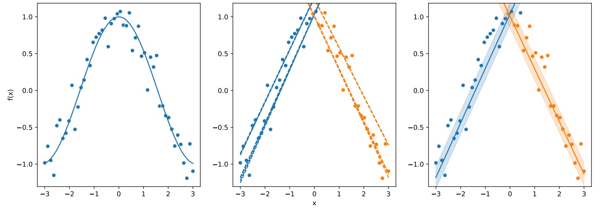

# ExplainReduce: Summarising local explanations via proxies
ExplainReduce is a global, model-agnostic, and post-hoc explanation method that extracts a small set of 'proxies' from a large collection of local models generated by local explanation methods (e.g., LIME and SHAP).
Each proxy is a representative local model that effectively captures the prediction behaviour of the black-box model within a specific neighbourhood.
The set of proxies summarizes the black-box model's decision pattern across different regions of the input space, facilitating global interpretability.

## Citations
Preprint of the ExplainReduce paper

> *Seppäläinen, Lauri, Mudong Guo, and Kai Puolamäki (2025)*.
> **`ExplainReduce`: Summarising Local Explanations via Proxies**
> Arxiv preprint [https://arxiv.org/abs/2502.10311](https://arxiv.org/abs/2502.10311).

## Installation
To install python, follow the instructions from the official website of [Python](https://www.python.org/downloads/).
To install the package, follow the instructions:
1. Create a virtual environment (Optional)
   ```bash
    # Create a virtual environment
    python -m venv venv
    
    # Activate the environment
    # Windows:
    .\venv\Scripts\activate
    # macOS/Linux:
    source venv/bin/activate
    ```
2. Clone the repository
   ```bash
    git clone $url_of_this_repository_from_github
    cd explainreduce
    ```
3. Install dependencies
   ```bash
    pip install -r requirements.txt
    ```
## Example
A simple example of the idea behind ExplainReduce. A black-box model (left) can have many local explanations (middle), but ExplainReduce can reduce the size of the local explanation set to get a global explanation consisting of two simple models (right).
<br><br>
